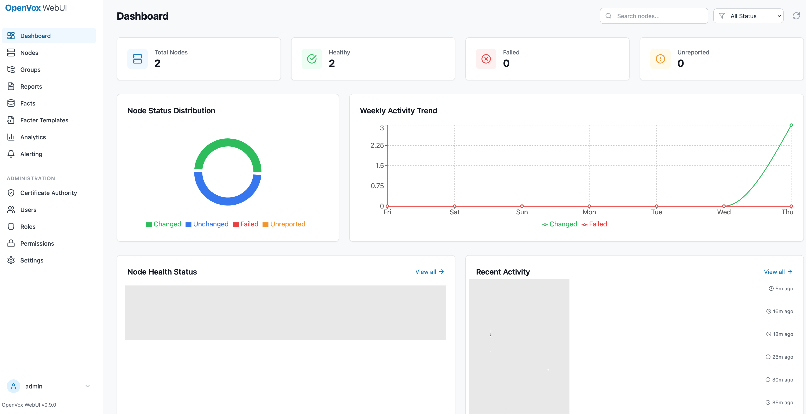

# OpenVox WebUI

A modern web interface for [OpenVox](https://voxpupuli.org/openvox/) infrastructure management.



## Features

- **PuppetDB Integration**: Query and visualize node data, facts, reports, and resources
- **Puppet CA Management**: List CSRs, sign/reject/revoke node certificates, renew CA certificate
- **Node Classification**: Puppet Enterprise-style node groups with rule-based classification
- **Facter Generation**: Generate external facts based on node classification
- **Dashboard**: Real-time infrastructure monitoring with charts and statistics
- **YAML Configuration**: Store local configuration data in YAML files

## Architecture

- **Backend**: Rust with Axum web framework
- **Frontend**: React with TypeScript, Tailwind CSS, and Recharts
- **Database**: SQLite for local storage
- **Testing**: Cucumber BDD for behavior-driven tests

## Quick Start

### Prerequisites

- Rust 1.75+
- Node.js 20+
- Docker and Docker Compose (optional, for PuppetDB)

### Development Setup

```bash
# Clone the repository
git clone https://github.com/ffquintella/openvox-webui.git
cd openvox-webui

# Copy example configuration
cp config/config.example.yaml config/config.yaml

# Build and run the backend
cargo build
cargo run

# In another terminal, run the frontend
cd frontend
npm install
npm run dev
```

### Using Docker

```bash
# Start all services
docker-compose up -d

# View logs
docker-compose logs -f

# Stop services
docker-compose down
```

## Project Structure

```
openvox-webui/
├── src/                    # Rust backend source
│   ├── api/               # API route handlers
│   ├── config/            # Configuration management
│   ├── db/                # Database layer
│   ├── handlers/          # Request handlers
│   ├── models/            # Data models
│   ├── services/          # Business logic
│   └── utils/             # Utilities
├── frontend/              # React frontend
│   ├── src/
│   │   ├── components/    # React components
│   │   ├── hooks/         # Custom hooks
│   │   ├── pages/         # Page components
│   │   ├── services/      # API client
│   │   ├── stores/        # State management
│   │   └── types/         # TypeScript types
│   └── tests/             # Frontend tests
├── tests/                 # Backend tests
│   ├── features/          # Cucumber BDD features
│   ├── integration/       # Integration tests
│   └── unit/              # Unit tests
├── config/                # Configuration files
├── migrations/            # Database migrations
└── docs/                  # Documentation
```

## Configuration

Configuration is stored in YAML files in the `config/` directory:

- `config.yaml` - Main application configuration
- `groups.yaml` - Node group definitions (optional)
- `facter_templates.yaml` - Facter generation templates (optional)

See `config/*.example.yaml` for examples.

## Testing

```bash
# Run all tests
cargo test

# Run BDD tests
cargo test --test cucumber

# Run frontend tests
cd frontend && npm test

# Run with coverage
cargo tarpaulin
```

## API Documentation

The API follows RESTful conventions:

- `GET /api/v1/nodes` - List all nodes
- `GET /api/v1/nodes/:certname` - Get node details
- `GET /api/v1/groups` - List node groups
- `POST /api/v1/groups` - Create node group
- `GET /api/v1/reports` - Query reports
- `GET /api/v1/facts` - Query facts
- `GET /api/v1/ca/status` - CA service status
- `GET /api/v1/ca/requests` - List pending CSRs
- `GET /api/v1/ca/certificates` - List signed certificates
- `POST /api/v1/ca/sign/:certname` - Sign CSR
- `POST /api/v1/ca/reject/:certname` - Reject CSR
- `DELETE /api/v1/ca/certificates/:certname` - Revoke certificate
- `POST /api/v1/ca/renew` - Renew CA certificate

See [docs/api/](docs/api/) for full API documentation.

## Contributing

See [CONTRIBUTING.md](CONTRIBUTING.md) for guidelines.

## License

Apache License 2.0 - See [LICENSE](LICENSE) for details.

## Links

- [OpenVox Project](https://voxpupuli.org/openvox/)
- [OpenVox GitHub](https://github.com/openvoxproject)
- [Vox Pupuli](https://voxpupuli.org/)
